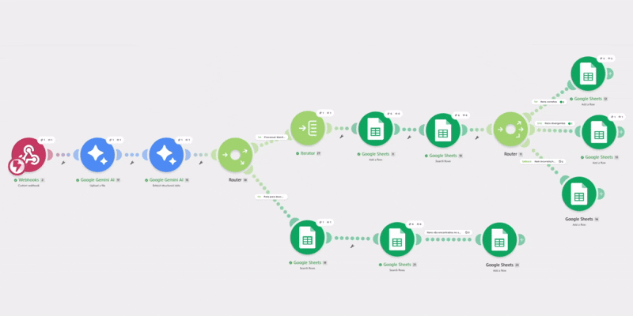
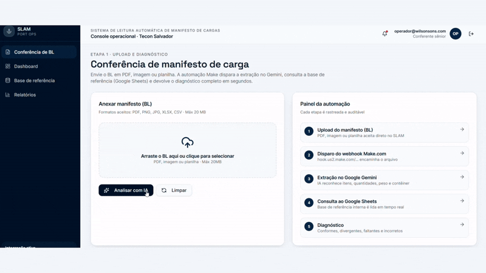

# 🚢 SLAM — Sistema de Leitura Automática de Manifesto de Cargas

Aplicação web para apoiar a conferência de documentos **BL (Bill of Lading)** no contexto portuário. O SLAM recebe um manifesto de carga, aciona uma automação externa com IA, compara os itens extraídos com uma base de referência e apresenta as divergências para o operador — reduzindo o tempo de conferência manual e o risco de erro humano.

## Fluxo principal

```
Operador → envia BL → Make.com → Gemini extrai itens → Google Sheets compara dados → SLAM consulta resultados → tela mostra diagnóstico
```

1. O operador acessa a landing page e realiza um login demonstrativo.
2. Em **"Conferência de BL"**, anexa um PDF, imagem, XLSX ou CSV de até 20 MB.
3. O arquivo é enviado por `POST` para um webhook do Make.com, configurado em `VITE_MAKE_WEBHOOK_URL`.
4. A tela consulta periodicamente uma planilha Google Sheets, por até 60 segundos, esperando a automação gravar o resultado.
5. Os itens retornam classificados em:
   - **Corretos** — correspondem à base.
   - **Divergentes** — existem, mas têm diferenças de quantidade, peso ou contêiner.
   - **Incorretos** — foram extraídos do manifesto, mas não possuem correspondência na referência.
   - **Faltantes** — constam na referência, mas não foram localizados no manifesto.
6. O resultado pode ser filtrado por status e exibido em uma tabela com os motivos da divergência.

## Telas e funcionalidades

| Área | O que faz | Fonte dos dados |
|---|---|---|
| Página inicial | Apresenta o produto e oferece login | Local |
| Console operacional | Menu, sessão, navegação responsiva e logout | `localStorage` |
| Conferência de BL | Upload, disparo da análise, progresso e resultado por item | Make.com + Google Sheets |
| Base de referência | Pesquisa e visualização dos itens esperados | Google Sheets, com fallback local |
| Dashboard | Indicadores, gráficos e histórico recente | Dados estáticos de demonstração |
| Relatórios | Lista relatórios e botão de PDF | Dados estáticos; download ainda não implementado |

## Base de referência e regras de comparação

A base local contém 30 itens, distribuídos em cinco BLs (`BL-2026-001` a `BL-2026-005`), com dados como:

- número do item;
- descrição;
- quantidade e unidade;
- peso em kg;
- contêiner;
- categoria da carga.

O código também contém uma regra de diagnóstico local (`runDiagnostic`) que compara os itens pelo par BL + número do item. Ela considera divergência quando quantidade, unidade, peso (com tolerância de 1 kg) ou contêiner diferem. **Porém, essa rotina não é usada pela tela atual de conferência**: na prática, o diagnóstico exibido vem das abas da planilha após a automação externa processar o arquivo.

## Automação Make.com — Conferência de Manifesto de Carga

Esta automação recebe um manifesto de carga (BL), extrai os itens declarados via IA, cruza com a base de referência interna (Google Sheets) e classifica cada item em **Correto**, **Divergente**, **Incorreto/Não cadastrado** ou **Faltante**.

### Visão geral do fluxo

```
Webhook (recebe o arquivo)
  └─ Gemini AI · Upload a file        → sobe o arquivo para a API do Gemini
      └─ Gemini AI · Extract structured data → extrai { bl, itens[] } do manifesto
          └─ Router
              ├─ Rota 1 · Processar Manifesto
              │     Iterator → percorre cada item extraído
              │       └─ Google Sheets · Add a Row        → log em "Itens_Extraidos"
              │           └─ Google Sheets · Search Rows  → busca item correspondente em "Itens_Referencia"
              │               └─ Router (comparação)
              │                     ├─ Itens corretos      → Add a Row → "Itens_Corretos"
              │                     ├─ Itens divergentes    → Add a Row → "Itens_Divergentes"
              │                     └─ fallback: incorreto/não cadastrado → Add a Row → "Itens_Incorretos"
              │
              └─ Rota 2 · Descobrir item faltante   (roda DEPOIS da Rota 1 terminar)
                    Google Sheets · Search Rows      → todas as linhas de referência daquele BL
                      └─ Google Sheets · Search Rows → procura cada uma em "Itens_Extraidos"
                          └─ Filter: 0 resultados encontrados
                              └─ Add a Row → "Itens_Faltantes"
```

### Por que duas rotas no primeiro Router

A Rota 1 responde "esse item do manifesto existe na base de referência?" — ela cobre **corretos**, **divergentes** e **incorretos**.
A Rota 2 responde a pergunta inversa: "esse item da base de referência apareceu no manifesto?" — só assim é possível detectar um item que **nunca foi extraído** (faltante).

A ordem importa: o Make processa as rotas de um Router sequencialmente para o mesmo bundle, então a Rota 1 grava tudo em `Itens_Extraidos` antes da Rota 2 começar a consultar esse mesmo log — é isso que garante que a checagem de itens faltantes seja confiável.

### Planilhas utilizadas

| Aba | Função |
|---|---|
| `Itens_Referencia` | Base de referência (sistema interno), somente leitura |
| `Itens_Extraidos` | Log bruto de tudo que a IA extraiu do manifesto |
| `Itens_Corretos` | Itens que batem 100% com a referência |
| `Itens_Divergentes` | Itens encontrados na referência, mas com quantidade/peso/contêiner diferente |
| `Itens_Incorretos` | Itens do manifesto sem correspondência na base |
| `Itens_Faltantes` | Itens da base que não apareceram no manifesto |

### Critérios de comparação

Um item é considerado:
- **Correto** — quantidade, peso bruto e contêiner idênticos aos da base de referência.
- **Divergente** — item encontrado na base (mesmo BL + Nº do item), mas com pelo menos um desses campos diferente.
- **Incorreto/não cadastrado** — item presente no manifesto, sem correspondência de BL + Nº do item na base.
- **Faltante** — item presente na base de referência para aquele BL, mas ausente no manifesto extraído.

### Resultado validado

Teste com o manifesto `BL-2026-001` (6 itens declarados): **5 corretos**, **1 divergente** (Kit de embreagem completo: manifesto declara 450 unidades/2.700 kg, base de referência tem 480 unidades/2.880 kg), **0 incorretos**, **0 faltantes** — confirmando o funcionamento ponta a ponta do fluxo.

## Arquitetura técnica

- **Frontend/SSR**: React com TanStack Start e TanStack Router.
- **Estado e dados**: React Query está configurado no nível raiz, mas ainda não há queries gerenciadas por ele nas telas.
- **Interface**: Tailwind CSS, componentes de UI reutilizáveis e notificações Sonner.
- **Gráficos**: Recharts.
- **Integrações externas**: Make.com, Gemini e Google Sheets.
- **Resiliência**: há tratamento de erro no cliente, página 404, tela de falha de carregamento e uma resposta HTML amigável para erros 500 no servidor. O `server.ts` ainda tenta normalizar erros que o H3/TanStack poderia devolver como JSON.

## O que já é real vs. o que é demonstrativo

A aplicação está posicionada como protótipo de homologação/hackathon, o que o próprio código informa.

**Já há integração real prevista para:**
- upload para webhook Make;
- leitura de abas de uma planilha Google;
- atualização/polling do resultado.

**Mas algumas partes são demonstrativas:**
- autenticação é local: aceita qualquer e-mail válido e qualquer senha numérica de exatamente 8 dígitos;
- sessão fica no `localStorage`, sem autenticação de servidor ou controle de permissões;
- dashboard usa números e gráficos fixos;
- lista de conferências recentes é fixa;
- relatórios são fixos e o botão "PDF" não gera/baixa arquivo;
- a base local é fallback caso a planilha não esteja acessível.

## Como executar o projeto

1. Clone este repositório:
```bash
git clone https://github.com/Vandriane/sistemademanifestodecargas.git
```

2. Acesse a pasta do projeto:
```bash
cd sistemademanifestodecargas
```

3. Instale as dependências:
```bash
npm install
# ou
bun install
```

4. Configure as variáveis de ambiente (crie um arquivo `.env` na raiz):
```bash
VITE_MAKE_WEBHOOK_URL=<url do webhook do Make.com>
VITE_SHEET_ID=<id da planilha do Google Sheets>
```

5. Rode o projeto localmente:
```bash
npm run dev
# ou
bun run dev
```

## Demonstração

**Aplicação em produção:** https://sistemademanifestodecargas.vercel.app/

**Automação no Make.com:**



**Upload e conferência de BL no site:**



## Objetivos

- Automatizar a conferência de manifestos de carga (BL);
- Reduzir o tempo de conferência manual e o risco de erro humano;
- Aumentar a confiabilidade da triagem inicial de divergências;
- Demonstrar a aplicação prática de IA em um processo real de logística portuária.

## Melhorias futuras

- Autenticação real, com backend e controle de permissões por perfil;
- Persistência das conferências em banco de dados (histórico real, não fixo);
- Geração e download de relatórios em PDF;
- Dashboard com indicadores calculados a partir de dados reais;
- Resposta síncrona do Make.com ao final do processamento, reduzindo a dependência do polling.

## Licença

Este projeto foi desenvolvido pela equipe Linus Torvalds para fins de estudo e demonstração (desafio Kodie Academy / Power Developers — Wilson Sons).

## Conecte-se com os membros da equipe

- Douglas Araujo: https://www.linkedin.com/in/douglasaraujo-daraujodb-dev
- Thiago Simas: https://www.linkedin.com/in/thiago-simas-4726b166/ 
- Vandriane Alves: https://www.linkedin.com/in/vandriane-alves/
